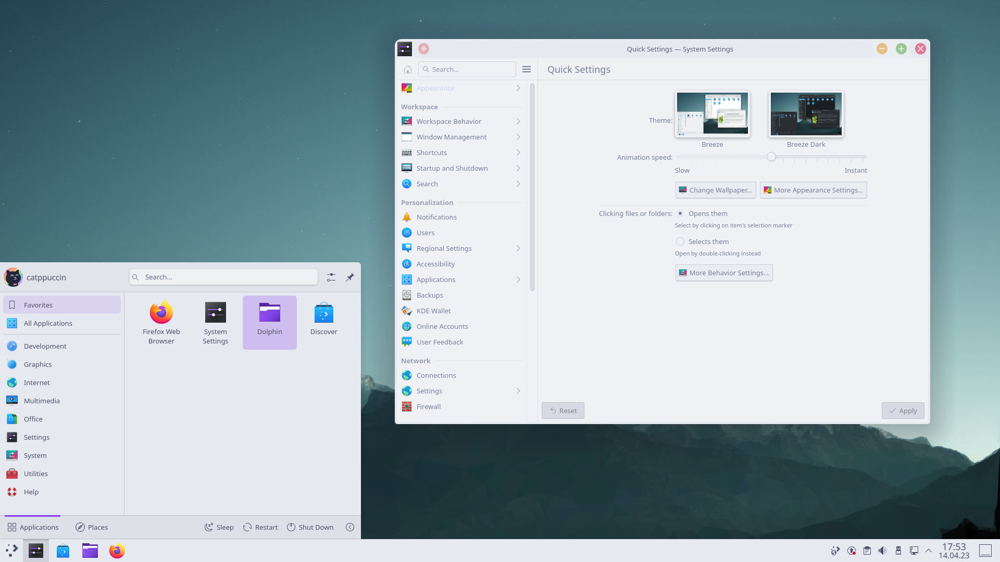
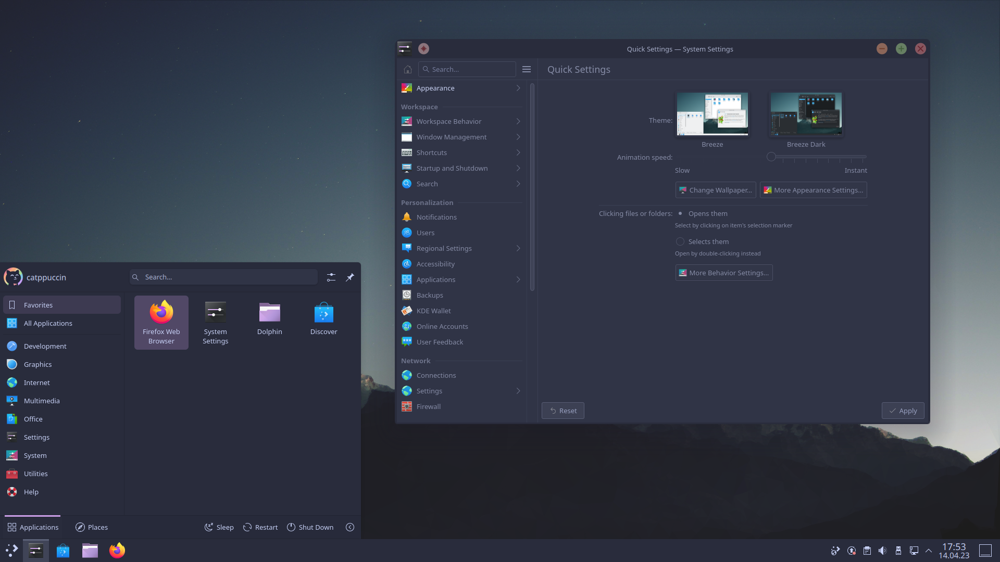
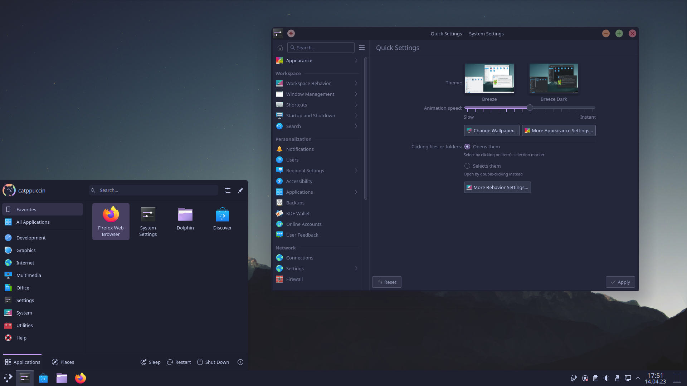
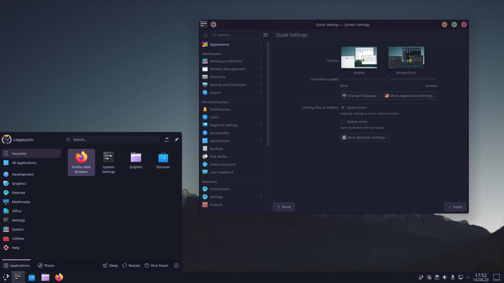

<h3 align="center">
	 
	
	Catppuccin for <a href="https://www.kde.org/">KDE</a>
	
</h3>

    
    
    

  

## Previews

🌻 Latte

🪴 Frappé

🌺 Macchiato

🌿 Mocha

## Installation

### For KDE Plasma Desktop:
1. `git clone https://github.com/catppuccin/kde catppuccin-kde && cd catppuccin-kde --depth=1`
2. Run the install script using `./install.sh` and follow the instructions.

### For Krita:
1. Download the colour-scheme zip file for your preffered flavour from the [release](https://github.com/catppuccin/kde/releases/) tab.
2. Extract the file and move the theme(s) you wish to install into the following folders for your platform:
   Windows: `%appdata%\krita\color-schemes`  
   Linux: `~/.local/share/krita/color-schemes`
3. Open Krita, and you can choose the theme from Settings > Themes.

## Notes
1. To get a modern, more consistent look, install the [Lightly application style](https://github.com/Luwx/Lightly) and select it from System Settings > Appearance >  Application Style > Lightly.
2. If you encounter an error similar to 'connection refused' while running the installation script, it may be due to store.kde.org being down or issues with your internet connection.

## Licensing
The theme makes modifications to [doncsugar's](https://github.com/doncsugar) [lightly plasma style](https://github.com/doncsugar/lightly-plasma). It is licensed under GPL 3.0 and as such, all the changes to the plasma theme are also licensed under GPL. The MIT License still applies to the color scheme, splash screen and the window decorations theme.

## 💝 Thanks to

- [Prayag2](https://github.com/Prayag2)
- [Sourcastic](https://github.com/Sourcastic)  
- [Cequallium](https://github.com/Cequallium)
- [justTOBBI](https://github.com/justTOBBI)

&nbsp;

Copyright &copy; 2021-present <a href="https://github.com/catppuccin" target="_blank">Catppuccin Org</a>

