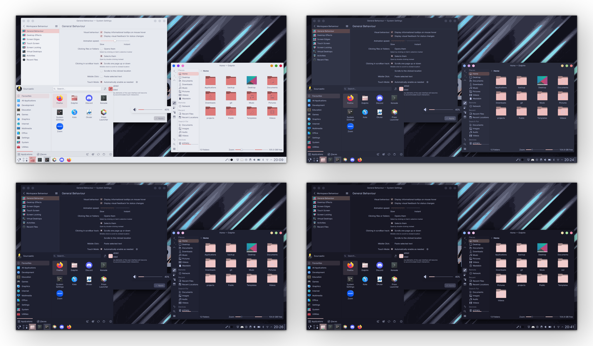
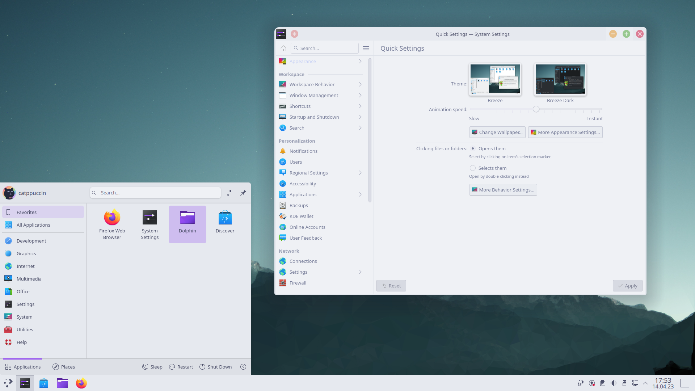
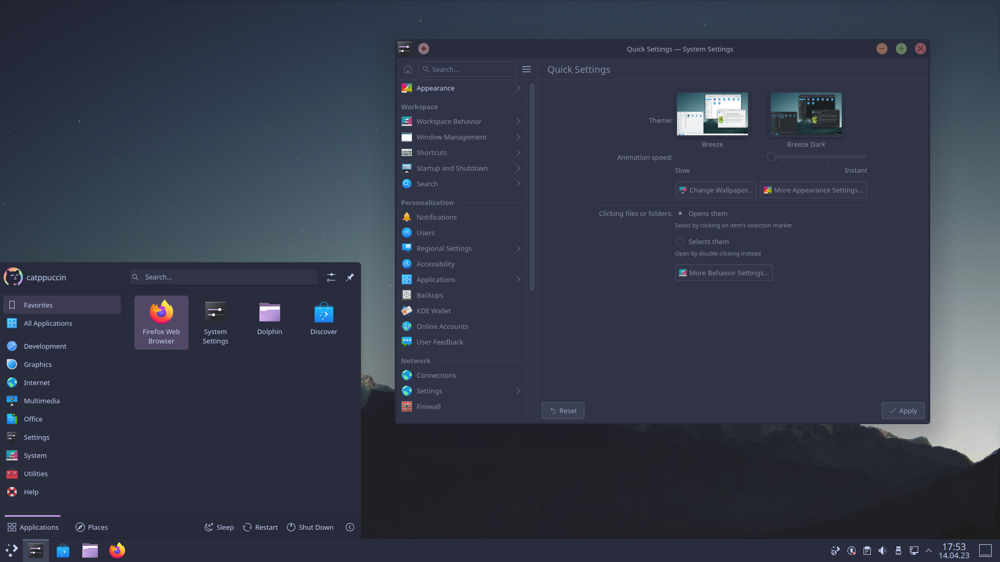
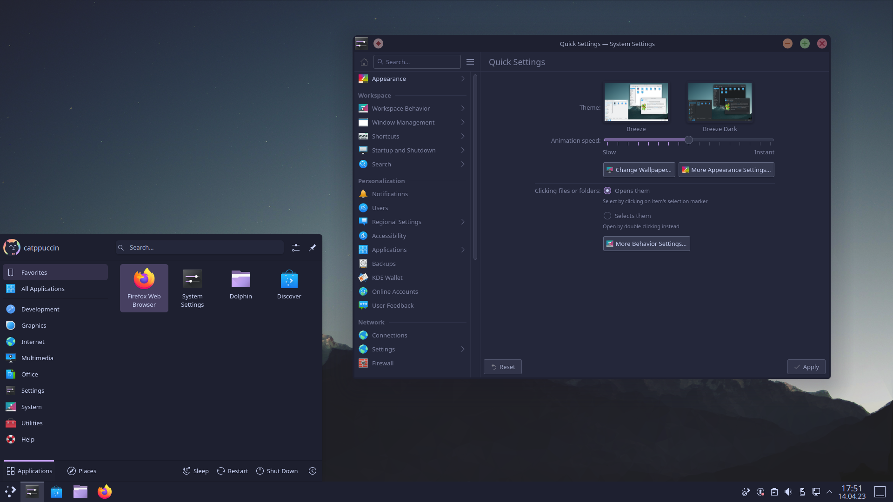
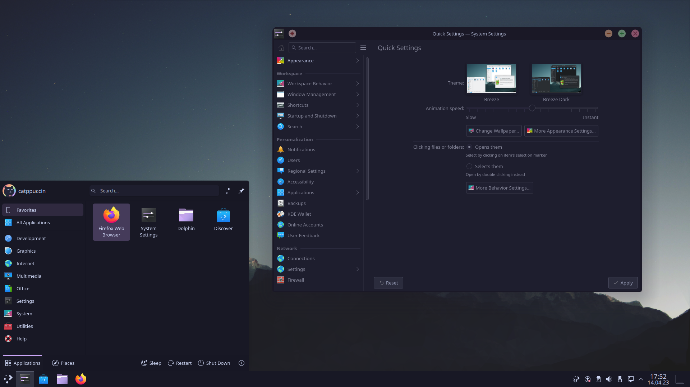

<h3 align="center">
	 
	
	Catppuccin for <a href="https://www.kde.org/">KDE</a>
	
</h3>

    
    
    

  

## Previews

🌻 Latte

🪴 Frappé

🌺 Macchiato

🌿 Mocha

## Installation

### For KDE Plasma Desktop:
1. `git clone --depth=1 https://github.com/catppuccin/kde catppuccin-kde && cd catppuccin-kde`
2. Run the install script using `./install.sh` and follow the instructions.

#### Automated Installation
Install without any prompts by passing the flavour, accent, and window-decoration numbers plus `auto`:

`./install.sh [-q|--quiet] <flavour 1-4> <accent 1-14> <window_decoration 1-2> auto`

Example (Mocha, Blue, Classic):
`./install.sh 1 13 2 auto`

### For Krita:
1. Download the colour-scheme zip file for your preferred flavour from the [release](https://github.com/catppuccin/kde/releases/) tab.
2. Extract the file and move the theme(s) you wish to install into the following folders for your platform:
   Windows: `%appdata%\krita\color-schemes`  
   Linux: `~/.local/share/krita/color-schemes`
3. Open Krita, and you can choose the theme from Settings > Themes.

## Notes
1. If you are using KDE 5.27 or below, you might want to run `git checkout v0.2.5`  before running the install script to avoid running into compatibility issues. Alternatively, the release binaries are available [here](https://github.com/catppuccin/kde/releases/tag/v0.2.5).
2. If you encounter an error similar to 'connection refused' while running the installation script, it may be due to store.kde.org being down or issues with your internet connection.

## 💝 Current Maintainers
- [Sourcastic](https://github.com/Sourcastic)
- [soleynn](https://github.com/soleynn)

## 💖 Past Maintainers
- [Prayag2](https://github.com/Prayag2)

&nbsp;

Copyright &copy; 2021-present <a href="https://github.com/catppuccin" target="_blank">Catppuccin Org</a>

